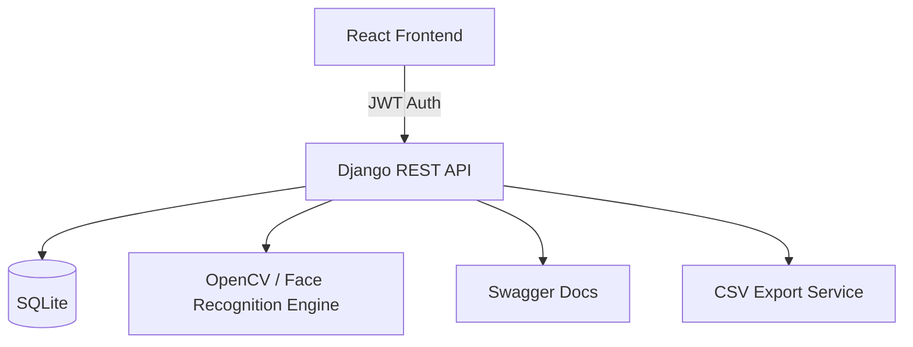

# 🛡️ Attendance Management System

A production-ready Attendance Management System featuring **Biometric Facial Recognition**, **Simple Two-Role RBAC**, and **Real-time Analytics**. Designed to replace traditional manual attendance with a secure, automated, and scalable digital solution.

---

## ✨ Features

### 👤 User Roles & RBAC
- **Admin**: Full system control - manage users, system settings, and analytics.
- **User**: General system users who can mark attendance and view their own logs.

### 🤖 Biometric Facial Recognition
- **Automated Marking**: Uses `dlib` and `face-recognition` to identify users in milliseconds.
- **Biometric Enrollment**: Store high-dimensional face embeddings for privacy and speed.
- **Face Scan**: Seamless login and check-in experience.

### 📊 Professional Dashboard
- **Real-time Analytics**: Visual trends for attendance rates.
- **CSV Export**: Export logs for records or compliance.
- **Mobile Responsive**: Fully functional on tablets and smartphones.

---

## 🏗️ System Architecture

---

## 🛠️ Tech Stack

- **Backend**: Python 3.12, Django 5.0, Django REST Framework
- **Frontend**: React 18, Vite, Tailwind CSS
- **Face Recognition**: OpenCV, dlib, face-recognition

---

## 🚀 Getting Started

### Prerequisites
- Python 3.12+
- Node.js 18+

### Setup
1. **Backend**:
   - `cd django`
   - `pip install -r requirements.txt`
   - `python manage.py migrate`
   - `python manage.py runserver`

2. **Frontend**:
   - `cd react`
   - `npm install`
   - `npm run dev`

---

## 📄 Database Schema

The system uses a consolidated User model:
- **User**: `id`, `username`, `email`, `role` (Admin/User), `face_embedding`.
- **Log**: `id`, `user_id` (FK), `timestamp`.

---

## 📄 License
This project is licensed under the MIT License.
